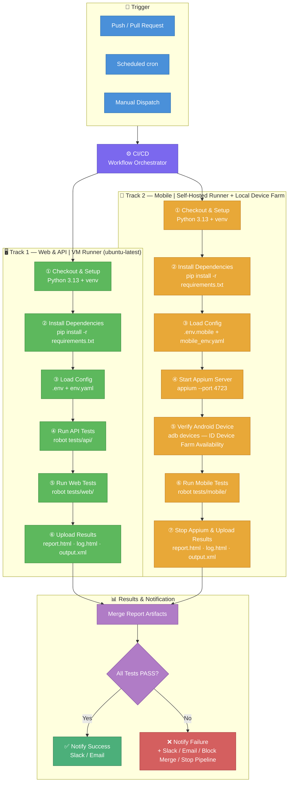

# CI/CD Pipeline Diagram
# Indodax Automation Framework

**Version:** 1.0
**Date:** February 2026
**Scope:** Two-track execution — VM-based (Web & API) + Local Device Farm (Mobile)

---

```mermaid
flowchart TB
    subgraph TRIGGER["🚀 Trigger"]
        direction LR
        T1["Push / Pull Request"]
        T2["Scheduled cron"]
        T3["Manual Dispatch"]
    end

    GHA["⚙️ CI/CD<br/>Workflow Orchestrator"]

    subgraph WEBAPI["🖥️ Track 1 — Web &amp; API  |  VM Runner (ubuntu-latest)"]
        direction TB
        W1["① Checkout &amp; Setup<br/>Python 3.13 + venv"]
        W2["② Install Dependencies<br/>pip install -r requirements.txt"]
        W3["③ Load Config<br/>.env + env.yaml"]
        W4["④ Run API Tests<br/>robot tests/api/"]
        W5["⑤ Run Web Tests<br/>robot tests/web/"]
        W6["⑥ Upload Results<br/>report.html · log.html · output.xml"]
        W1 --> W2 --> W3 --> W4 --> W5 --> W6
    end

    subgraph MOBILE["📱 Track 2 — Mobile  |  Self-Hosted Runner + Local Device Farm"]
        direction TB
        M1["① Checkout &amp; Setup<br/>Python 3.13 + venv"]
        M2["② Install Dependencies<br/>pip install -r requirements.txt"]
        M3["③ Load Config<br/>.env.mobile + mobile_env.yaml"]
        M4["④ Start Appium Server<br/>appium --port 4723"]
        M5["⑤ Verify Android Device<br/>adb devices — ID Device Farm Availability"]
        M6["⑥ Run Mobile Tests<br/>robot tests/mobile/"]
        M7["⑦ Stop Appium &amp; Upload Results<br/>report.html · log.html · output.xml"]
        M1 --> M2 --> M3 --> M4 --> M5 --> M6 --> M7
    end

    subgraph REPORT["📊 Results &amp; Notification"]
        direction TB
        R1["Merge Report Artifacts"]
        R2{"All Tests PASS?"}
        R3["✅ Notify Success<br/>Slack / Email"]
        R4["❌ Notify Failure<br/>+ Slack / Email / Block Merge / Stop Pipeline"]
        R1 --> R2
        R2 -->|Yes| R3
        R2 -->|No| R4
    end

    TRIGGER --> GHA
    GHA --> W1
    GHA --> M1
    W6 --> R1
    M7 --> R1

    classDef trigger  fill:#4A90D9,stroke:#2C6FAC,color:#fff
    classDef gha      fill:#7B68EE,stroke:#5A4FBB,color:#fff
    classDef vm       fill:#5DB85D,stroke:#3A8A3A,color:#fff
    classDef mobile   fill:#E8A838,stroke:#C07D1C,color:#fff
    classDef pass     fill:#4CAF7A,stroke:#2F7A52,color:#fff
    classDef fail     fill:#D45F5F,stroke:#A33A3A,color:#fff
    classDef report   fill:#B07CC6,stroke:#844FA0,color:#fff

    class T1,T2,T3 trigger
    class GHA gha
    class W1,W2,W3,W4,W5,W6 vm
    class M1,M2,M3,M4,M5,M6,M7 mobile
    class R1,R2 report
    class R3 pass
    class R4 fail
```
