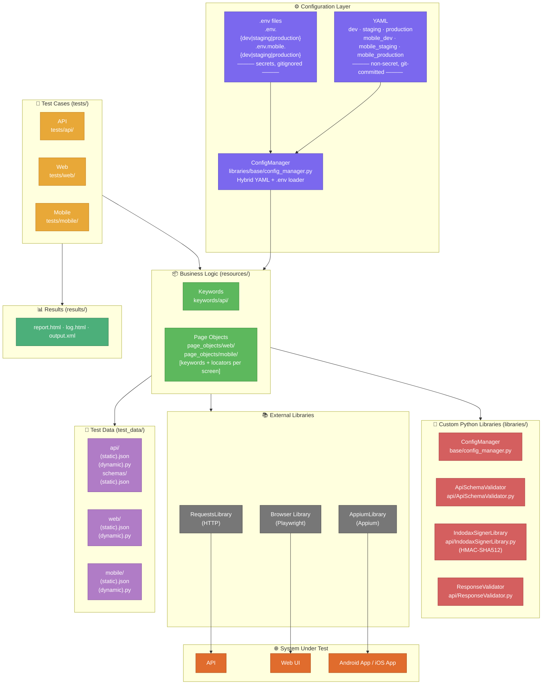

# High-Level Architecture Diagram
# Indodax Automation Framework

**Version:** 1.0
**Date:** February 2026
**Scope:** `automation-framework/`

---

```mermaid
graph TB
    subgraph CONFIG["⚙️ Configuration Layer"]
        direction LR
        YAML["YAML<br/>dev · staging · production<br/>mobile_dev · mobile_staging · mobile_production<br/>——— non-secret, git-committed ———"]
        ENV[".env files<br/>.env.{dev|staging|production}<br/>.env.mobile.{dev|staging|production}<br/>——— secrets, gitignored ———"]
        CM["ConfigManager<br/>libraries/base/config_manager.py<br/>Hybrid YAML + .env loader"]
        YAML --> CM
        ENV  --> CM
    end

    subgraph TESTS["🧪 Test Cases  (tests/)"]
        TA["API<br/>tests/api/"]
        TW["Web<br/>tests/web/"]
        TM["Mobile<br/>tests/mobile/"]
    end

    subgraph BL["📦 Business Logic  (resources/)"]
        direction LR
        KW["Keywords<br/>keywords/api/"]
        PO["Page Objects<br/>page_objects/web/<br/>page_objects/mobile/<br/>[keywords + locators per screen]"]
    end

    subgraph LIBS["🔧 Custom Python Libraries  (libraries/)"]
        direction LR
        L1["ConfigManager<br/>base/config_manager.py"]
        L2["ApiSchemaValidator<br/>api/ApiSchemaValidator.py"]
        L3["IndodaxSignerLibrary<br/>api/IndodaxSignerLibrary.py<br/>(HMAC-SHA512)"]
        L4["ResponseValidator<br/>api/ResponseValidator.py"]
    end

    subgraph EXT["📚 External Libraries"]
        direction LR
        E1["RequestsLibrary<br/>(HTTP)"]
        E2["Browser Library<br/>(Playwright)"]
        E3["AppiumLibrary<br/>(Appium)"]
    end

    subgraph DATA["📁 Test Data  (test_data/)"]
        direction LR
        D1["api/<br/>(static).json<br/>(dynamic).py<br/>schemas/<br/>(static).json"]
        D2["web/<br/>(static).json<br/>(dynamic).py"]
        D3["mobile/<br/>(static).json<br/>(dynamic).py"]
    end

    subgraph SUT["🌐 System Under Test"]
        direction LR
        S2["API"]
        S3["Web UI"]
        S4["Android App / iOS App"]
    end

    subgraph OUT["📊 Results  (results/)"]
        R1["report.html · log.html · output.xml"]
    end

    CM      --> BL

    TESTS --> BL
    BL    --> LIBS
    BL    --> EXT
    BL    --> DATA

    E1 --> S2
    E2 --> S3
    E3 --> S4

    TESTS --> OUT

    classDef config  fill:#7B68EE,stroke:#5A4FBB,color:#fff
    classDef tests   fill:#E8A838,stroke:#C07D1C,color:#fff
    classDef bl      fill:#5DB85D,stroke:#3A8A3A,color:#fff
    classDef libs    fill:#D45F5F,stroke:#A33A3A,color:#fff
    classDef ext     fill:#777,stroke:#444,color:#fff
    classDef data    fill:#B07CC6,stroke:#844FA0,color:#fff
    classDef sut     fill:#E06C2D,stroke:#A84A13,color:#fff
    classDef out     fill:#4CAF7A,stroke:#2F7A52,color:#fff

    class YAML,ENV,CM config
    class TA,TW,TM tests
    class KW,PO bl
    class L1,L2,L3,L4 libs
    class E1,E2,E3 ext
    class D1,D2,D3 data
    class S2,S3,S4 sut
    class R1 out
```

