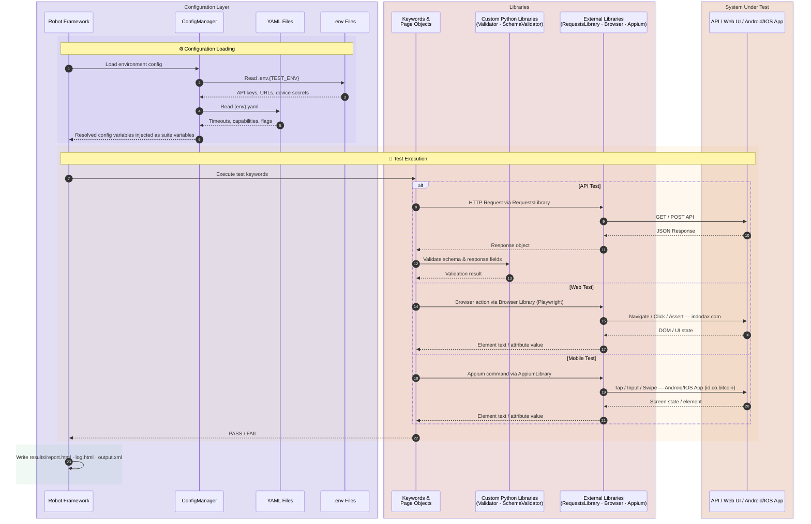

# Sequence Diagram — Surface View
# Indodax Automation Framework

**Version:** 1.0
**Date:** February 2026
**Scope:** End-to-end test execution flow (surface level)

---

```mermaid
sequenceDiagram
    autonumber

    

    box rgba(123,104,238,0.15) Configuration Layer
        participant RF as Robot Framework
        participant CM as ConfigManager
        participant YML as YAML Files
        participant ENV as .env Files
    end

    box rgba(213,95,95,0.15) Libraries
        participant KW as Keywords &<br/>Page Objects
        participant PY as Custom Python Libraries<br/>(Validator · SchemaValidator)
        participant EXT as External Libraries<br/>(RequestsLibrary · Browser · Appium)
    end

    box rgba(224,108,45,0.15) System Under Test
        participant SUT as API / Web UI / Android/IOS App
    end


    rect rgba(123,104,238,0.08)
        Note over RF,ENV: ⚙️ Configuration Loading
        RF->>CM: Load environment config
        CM->>ENV: Read .env.{TEST_ENV}
        ENV-->>CM: API keys, URLs, device secrets
        CM->>YML: Read {env}.yaml
        YML-->>CM: Timeouts, capabilities, flags
        CM-->>RF: Resolved config variables injected as suite variables
    end

    rect rgba(232,168,56,0.08)
        Note over RF,SUT: 🧪 Test Execution
        RF->>KW: Execute test keywords

        alt API Test 
            KW->>EXT: HTTP Request via RequestsLibrary
            EXT->>SUT: GET / POST API
            SUT-->>EXT: JSON Response
            EXT-->>KW: Response object
            KW->>PY: Validate schema & response fields
            PY-->>KW: Validation result
        else Web Test 
            KW->>EXT: Browser action via Browser Library (Playwright)
            EXT->>SUT: Navigate / Click / Assert — indodax.com
            SUT-->>EXT: DOM / UI state
            EXT-->>KW: Element text / attribute value
        else Mobile Test 
            KW->>EXT: Appium command via AppiumLibrary
            EXT->>SUT: Tap / Input / Swipe — Android/IOS App (id.co.bitcoin)
            SUT-->>EXT: Screen state / element
            EXT-->>KW: Element text / attribute value
        end

        KW-->>RF: PASS / FAIL
    end

    rect rgba(76,175,122,0.08)
        RF->>RF: Write results/report.html · log.html · output.xml
    end
```
